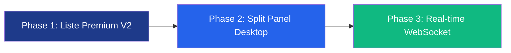

# 🎨 Proposition Créative — Messages & Mes Offres
## Direction Artistique · Transporti V1

> **Objectif** : Proposer des redesigns modernes et cohérents pour les interfaces **Messages** et **Mes Offres**, en respectant strictement la charte graphique Transporti (Royal Blue `#1E3A8A`, Accent Green `#10b981`).

---

## 1. Interface Messages

### Diagnostic de l'existant

| Point | Score | Observation |
|---|---|---|
| Structure | 7/10 | Liste simple, fonctionnelle mais basique |
| Hiérarchie visuelle | 6/10 | Distinction read/unread correcte mais peu impactante |
| Modernité | 5/10 | Manque de profondeur visuelle, pas de split-panel |
| Micro-interactions | 4/10 | Aucune animation de transition, hover minimal |
| Mobile-ready | 7/10 | Layout responsive mais pas optimisé mobile-first |

### Variante A — Liste Premium (Recommandée pour mobile-first)

**Améliorations clés :**

| Élément | Actuel | Proposé |
|---|---|---|
| **Avatar** | Cercle basique brand-600/10 | Avatar avec initiales, brand-600 solide si non lu, gradient subtil si lu |
| **Card unread** | `bg-brand-600/[0.02]` | Left-border 3px Royal Blue + fond bleuté 2% + texte bold |
| **Status badge** | Pill 10px sans icône | Pill avec dot coloré + icône contextuelle |
| **Timestamp** | Texte gris basique | Position relative en gras si < 1h |
| **Hover** | Border change | Shadow lift `-translate-y-0.5` + border glow |
| **Empty state** | Icône + texte | Illustration SVG animée + CTA accent |

> [!TIP]
> **Idéal pour** : mobile-first, PWA, usage quotidien rapide. La liste plate permet un scan visuel ultra-rapide.

---

### Variante B — Split Panel (Pour desktop power users)

**Innovations :**

| Élément | Description |
|---|---|
| **Layout** | 40/60 split — liste à gauche, conversation à droite |
| **Bulles** | Own = Royal Blue bg + white text, Other = neutral-100 |
| **Input bar** | Rounded-xl, paperclip + send button accent green |
| **Status** | Dot vert "En ligne" dans le header conversation |
| **System msgs** | Centrés, italique gris, icône robot |
| **Job context** | Badge "Transport #1234" dans le header conversation |

> [!IMPORTANT]
> La variante B nécessite un **responsive breakpoint** : en dessous de `lg`, on revient automatiquement sur la Variante A (liste seule → tap → conversation plein écran).

---

## 2. Interface Mes Offres

### Diagnostic de l'existant

| Point | Score | Observation |
|---|---|---|
| Stats row | 8/10 | Bon design, micro-animations hover |
| Filter tabs | 7/10 | Fonctionnel mais le count pill manque de contraste |
| Offer cards | 6/10 | Dense, breakdown prix utile mais layout plat |
| Distinction par statut | 6/10 | Codage couleur via badge mais pas assez différencié |
| Scan rapide | 5/10 | Trop de texte concentré, difficile à scanner vite |

### Variante A — Liste Enrichie (Recommandée)

**Améliorations clés :**

| Élément | Actuel | Proposé |
|---|---|---|
| **Stats cards** | `rounded-xl` basique | `rounded-2xl` + icône dans cercle coloré + hover lift |
| **Filter tabs** | Pill plat | Pill avec icône + count badge accent-50 pour l'actif |
| **Card PENDING** | Border neutre | Amber left-border 3px + timer badge amber animé (pulse) |
| **Card ACCEPTED** | Border emerald | Green left-border 3px + green glow shadow + "Client" info |
| **Card REJECTED** | Border neutre + opacity 75% | Muted 70% + strikethrough subtil sur le prix |
| **Prix breakdown** | Grid 3-col dans neutral-50 | Cards mini avec icône, visual separator, net en vert gras |
| **Actions** | Liens text-xs | Boutons ghost avec icône, hover animation |

> [!TIP]
> La variante A est la plus proche de l'existant — transition douce, minimal de disruption pour les utilisateurs actuels.

---

### Variante B — Vue Kanban (Pour power transporteurs)

**Innovations :**

| Élément | Description |
|---|---|
| **Vue toggle** | Icônes list/kanban dans le header — switch de vue |
| **4 colonnes** | En attente (amber) · Acceptées (green) · Refusées (red) · Expirées (grey) |
| **Cards compactes** | Route + prix + date seulement, clic pour expand |
| **Column headers** | Dot coloré + count + sous-titre montant total |
| **Tint backgrounds** | Chaque colonne a un fond teinté ultra-léger (3% opacity) |
| **Quick actions** | Hover → boutons "Retirer" ou "Contacter" apparaissent |

> [!WARNING]
> La vue Kanban est un **power feature** — recommandée uniquement si les transporteurs gèrent 10+ offres simultanées. Sinon la vue liste (Variante A) reste plus efficace.

---

## 3. Recommandations DA

### Messages : Variante A + évolution vers B

1. **Phase immédiate** : Implémenter la Variante A (liste enrichie) — impact max, effort minimal
2. **Phase suivante** : Ajouter le split-panel pour desktop (`lg:` breakpoint)
3. **Futur** : WebSocket pour messages temps réel

### Mes Offres : Variante A par défaut, toggle Kanban optionnel

1. **Phase immédiate** : Variante A (cards enrichies) — transitions naturelles depuis l'existant
2. **Futur optionnel** : Toggle vue Liste/Kanban pour les power users

### Tokens Design Utilisés

| Token | Valeur | Usage |
|---|---|---|
| `brand-600` | `#1E3A8A` | Headers, badges actifs, avatars unread |
| `brand-600/5` | 5% opacity | Fond tabs, fond cards hover |
| `brand-600/10` | 10% opacity | Avatar lu, badges inactifs |
| `accent-500` | `#10b981` | CTA send, status "Acceptée", dots online |
| `amber-500/600` | System | Badge "En attente", timer countdown |
| `red-500` | System | "Refusée", "Retirer" action |
| `neutral-50/100` | System | Fonds secondaires, bulles message |
| `rounded-2xl` | 16px | Cards, avatars grands |
| `rounded-xl` | 12px | Input bars, pills, mini-cards |

---

> [!NOTE]
> Ces mockups sont des **propositions conceptuelles**. Les variantes A sont recommandées pour une implémentation immédiate. Les variantes B sont des évolutions futures qui peuvent être planifiées dans un sprint ultérieur.

**En attente de votre validation pour lancer l'implémentation.**
